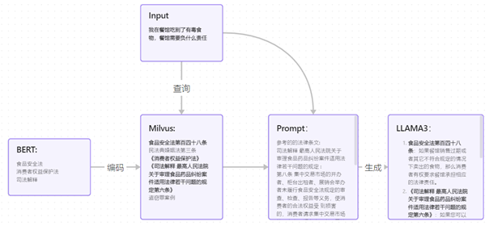

# RAGLaw

linux开发
使用RAG技术，实现法律模型

## 开始
创建环境
```
conda create -n RAGLaw python=3.10
conda activate RAGLaw
```
有gpu需要设置环境变量
```
# 有gpu
set CMAKE_ARGS=-DLLAMA_CUBLAS=on
set FORCE_CMAKE=1
pip install llama-cpp-python --force-reinstall --upgrade --no-cache-dir
```


安装依赖

```
git clone https://github.com/20km-shimakaze/RAGLaw.git
pip install -r requirements.txt
cd RAGLaw
```

安装编译llama.cpp
```
git clone https://github.com/ggerganov/llama.cpp.git
cd llama.cpp
make
pip install -r requirements.txt
cd ..
```

## 运行
llama.cpp
`python -m llama_cpp.server --host 0.0.0.0 --model ./models/llama3/Llama3-8B-Chinese-Chat-q8_0-v2_1.gguf --n_ctx 8192 --n_gpu_layers 28`


## 设计
- 数据库 milvus
- 语言 python 
- 模型 
  - BERT模型法律微调版
  - llama3 8b中文微调版

## 运行逻辑
### 使用
1. 用户输入提问
2. embedding模型转化为向量
   1. 数据库查询
      1. 法条
      2. 判例
   2. 网页搜索答案
3. 结合查询数据，组成prompt
4. 模型输出结果

## 代码架构
- db 数据库调用
- law_data 法律数据
- models 模型存放位置
- chat 聊天对话，查找数据
- scrips 法律数据处理，保存至数据库
- webui 前端ui

## 数据库架构
### law_vec
> 使用miluvs储存法律信息的数据库
- id 数据id
- law_type 信息的类型
  - law_book 法律法规
  - xxx 法律判例
- vector 向量
- info 对应的文字
